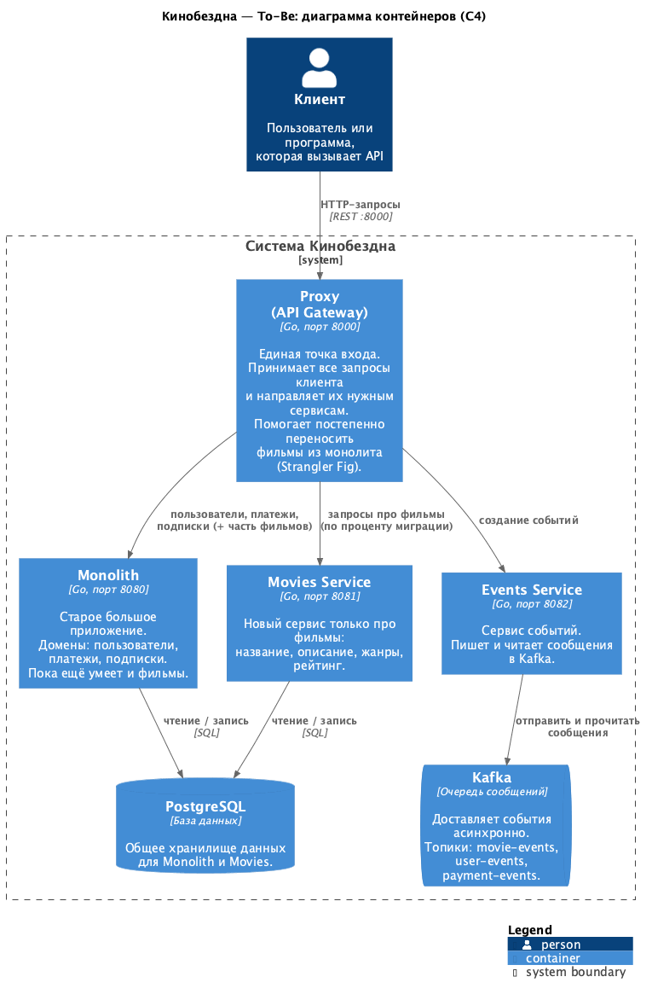
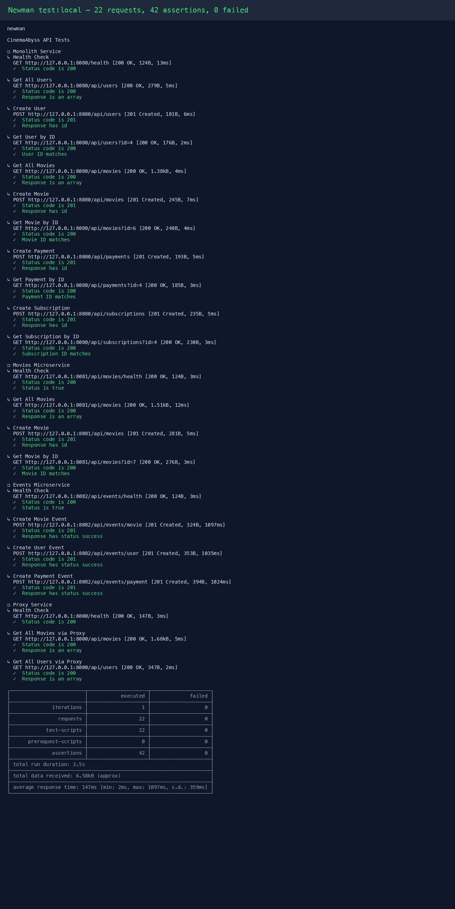
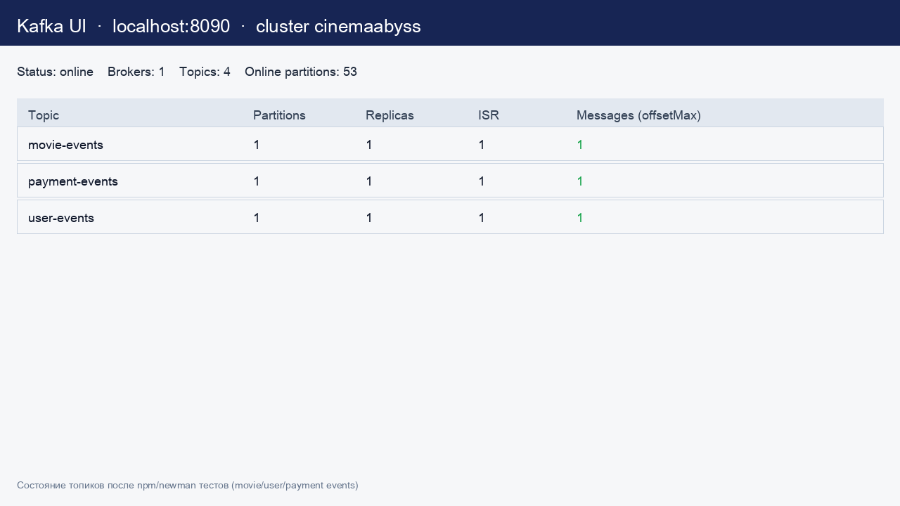

## Изучите [README.md](.\README.md) файл и структуру проекта.

# Задание 1

1. Спроектируйте to be архитектуру КиноБездны, разделив всю систему на отдельные домены и организовав интеграционное взаимодействие и единую точку вызова сервисов.

**Зачем так делим.** Сейчас почти всё живёт в одном большом приложении (монолит). To-Be — целевая картинка: фильмы выносим в отдельный сервис, события — в сервис с Kafka, а клиент всегда ходит в одну точку — Proxy (API Gateway). Так проще менять части системы по очереди, не ломая входной API.

**Домены (зоны ответственности):**

| Домен | Где живёт | Что делает |
|-------|-----------|------------|
| Users | Monolith | Пользователи |
| Payments | Monolith | Платежи |
| Subscriptions | Monolith | Подписки |
| Movies | Movies Service (+ пока ещё Monolith) | Фильмы, жанры, рейтинг |
| Events | Events Service | События через Kafka |

**Как сервисы связаны.** Клиент → Proxy → нужный сервис. Monolith и Movies пишут в PostgreSQL. Events пишет и читает сообщения в Kafka. Proxy постепенно переводит запросы `/api/movies` с монолита на Movies Service (паттерн Strangler Fig — «потихоньку обходим старое приложение новым»).



Исходник: [docs/c4/c4-container-to-be.puml](docs/c4/c4-container-to-be.puml)

# Задание 2

### 1. Proxy (API Gateway + Strangler Fig)

**Зачем нужен Proxy.** Клиент ходит в одну точку (`localhost:8000`), а Proxy решает, куда отправить запрос: в старый монолит или в новый сервис. Так можно переезжать по частям и не ломать API для клиентов. Соответствуем паттерну Strangler Fig — «потихоньку обходим старое новым».

**Что сделано.** Сервис на Go в `src/microservices/proxy`:

| Путь | Куда идёт |
|------|-----------|
| `/health` | отвечает сам Proxy |
| `/api/movies*` | монолит **или** Movies Service (по фиче-флагу) |
| `/api/events*` | Events Service |
| всё остальное | монолит |

**Фиче-флаг миграции:**

- `GRADUAL_MIGRATION=true` + `MOVIES_MIGRATION_PERCENT=50` → примерно половина запросов movies уходит в новый сервис, остальное — в монолит;
- `MOVIES_MIGRATION_PERCENT=100` → все movies в Movies Service;
- `MOVIES_MIGRATION_PERCENT=0` → все movies в монолит;
- `GRADUAL_MIGRATION=false` → весь movies-трафик сразу в Movies Service.

Проверка:

```bash
docker compose up -d --build
curl http://localhost:8000/health
curl http://localhost:8000/api/movies
curl http://localhost:8000/api/users
```

При `MOVIES_MIGRATION_PERCENT=100` в логах Proxy видно `-> http://movies-service:8081`, при `0` — `-> http://monolith:8080`.

### 2. Kafka + Events Service

**Зачем Kafka здесь.** Нужно проверить гипотезу: можно ли быстро добавить событие «что-то произошло» без жёсткой связки сервисов. MVP: один сервис и пишет в топик, и сам же читает (producer + consumer).

**Что сделано.** Сервис на Go в `src/microservices/events` (в `docker-compose.yml` уже описан):

| API | Kafka-топик |
|-----|-------------|
| `POST /api/events/movie` | `movie-events` |
| `POST /api/events/user` | `user-events` |
| `POST /api/events/payment` | `payment-events` |
| `GET /api/events/health` | — |

При вызове API событие пишется в Kafka, consumer читает его и пишет в лог контейнера.

### 3. Проверка тестами и скриншоты

Запуск:

```bash
cd tests/postman
npm install
npm run test:local
```

Результат: **22 запроса, 42 assertions, 0 failed** (включая Events и Proxy).



Исходник лога: [docs/evidence/newman-test-local.txt](docs/evidence/newman-test-local.txt)

Состояние топиков Kafka UI (`http://localhost:8090`):



Данные топиков: [docs/evidence/kafka-topics.json](docs/evidence/kafka-topics.json)

# Задание 3

Команда начала переезд в Kubernetes для лучшего масштабирования и повышения надежности. 
Вам, как архитектору осталось самое сложное:
 - реализовать CI/CD для сборки прокси сервиса
 - реализовать необходимые конфигурационные файлы для переключения трафика.


### CI/CD

После каждого пуша нужно автоматически собрать Docker-образы сервисов и проверить API тестами. Образы кладём в GitHub Container Registry (`ghcr.io`) — из них потом поднимаем Kubernetes.

**Что сделано в** [`.github/workflows/docker-build-push.yml`](.github/workflows/docker-build-push.yml):

| Образ | Контекст сборки | Куда пушится |
|-------|-----------------|--------------|
| monolith | `src/monolith` | `ghcr.io/<owner>/<repo>/monolith` |
| movies-service | `src/microservices/movies` | `ghcr.io/<owner>/<repo>/movies-service` |
| events-service | `src/microservices/events` | `ghcr.io/<owner>/<repo>/events-service` |
| proxy-service | `src/microservices/proxy` | `ghcr.io/<owner>/<repo>/proxy-service` |

Триггеры: push в `main`/`cinema` (если менялись `src/**` или сам workflow), published release, ручной запуск (`workflow_dispatch`).

Теги образов: `latest`, имя ветки, короткий SHA.

**API-тесты в CI.** Workflow [`.github/workflows/api-tests.yml`](.github/workflows/api-tests.yml) поднимает стек через `docker compose up -d --build`, ждёт health-эндпоинты и гоняет Newman в Docker-сети `cinemaabyss-network`.

Успешный результат шага: зелёные Actions (**Docker Build and Push** + **API Tests**) и образы proxy/events в GHCR.

Для этого репозитория образы будут вида:
`ghcr.io/s-klimov/architecture-cinemaabyss/proxy-service:latest`
`ghcr.io/s-klimov/architecture-cinemaabyss/events-service:latest`


### Proxy в Kubernetes

#### Шаг 1
Для деплоя в kubernetes необходимо залогиниться в docker registry Github'а.
1. Создайте Personal Access Token (PAT) https://github.com/settings/tokens . Создавайте class с правом read:packages
2. В `src/kubernetes/*.yaml` прописаны пути до образов из GHCR:

| Манифест | Образ |
|----------|--------|
| [monolith.yaml](src/kubernetes/monolith.yaml) | `ghcr.io/s-klimov/architecture-cinemaabyss/monolith:latest` |
| [movies-service.yaml](src/kubernetes/movies-service.yaml) | `ghcr.io/s-klimov/architecture-cinemaabyss/movies-service:latest` |
| [events-service.yaml](src/kubernetes/events-service.yaml) | `ghcr.io/s-klimov/architecture-cinemaabyss/events-service:latest` |
| [proxy-service.yaml](src/kubernetes/proxy-service.yaml) | `ghcr.io/s-klimov/architecture-cinemaabyss/proxy-service:latest` |

Пример в манифесте:

```yaml
spec:
  containers:
  - name: events-service
    image: ghcr.io/s-klimov/architecture-cinemaabyss/events-service:latest
```

3. Добавьте в секрет src/kubernetes/dockerconfigsecret.yaml в поле
```bash
 .dockerconfigjson: значение в base64 файла ~/.docker/config.json
```

4. Если в ~/.docker/config.json нет значения для аутентификации
```json
{
        "auths": {
                "ghcr.io": {
                       тут пусто
                }
        }
}
```
то выполните 

и добавьте

```json 
 "auth": "имя пользователя:токен в base64"
```

Чтобы получить значение в base64 можно выполнить команду
```bash
 echo -n ваш_логин:ваш_токен | base64
```

После заполнения config.json, также прогоните содержимое через base64

```bash
cat .docker/config.json | base64
```

и полученное значение добавляем в

```bash
 .dockerconfigjson: значение в base64 файла ~/.docker/config.json
```

#### Шаг 2

  Доработайте src/kubernetes/event-service.yaml и src/kubernetes/proxy-service.yaml

  - Необходимо создать Deployment и Service 
  - Доработайте ingress.yaml, чтобы можно было с помощью тестов проверить создание событий
  - Выполните дальшейшие шаги для поднятия кластера:

  1. Создайте namespace:
  ```bash
  kubectl apply -f src/kubernetes/namespace.yaml
  ```
  2. Создайте секреты и переменные
  ```bash
  kubectl apply -f src/kubernetes/configmap.yaml
  kubectl apply -f src/kubernetes/secret.yaml
  kubectl apply -f src/kubernetes/dockerconfigsecret.yaml
  kubectl apply -f src/kubernetes/postgres-init-configmap.yaml
  ```

  3. Разверните базу данных:
  ```bash
  kubectl apply -f src/kubernetes/postgres.yaml
  ```

  На этом этапе если вызвать команду
  ```bash
  kubectl -n cinemaabyss get pod
  ```
  Вы увидите

  NAME         READY   STATUS    
  postgres-0   1/1     Running   

  4. Разверните Kafka:
  ```bash
  kubectl apply -f src/kubernetes/kafka/kafka.yaml
  ```

  Проверьте, теперь должно быть запущено 3 пода, если что-то не так, то посмотрите логи
  ```bash
  kubectl -n cinemaabyss logs имя_пода (например - kafka-0)
  ```

  5. Разверните монолит:
  ```bash
  kubectl apply -f src/kubernetes/monolith.yaml
  ```
  6. Разверните микросервисы:
  ```bash
  kubectl apply -f src/kubernetes/movies-service.yaml
  kubectl apply -f src/kubernetes/events-service.yaml
  ```
  7. Разверните прокси-сервис:
  ```bash
  kubectl apply -f src/kubernetes/proxy-service.yaml
  ```

  После запуска и поднятия подов вывод команды 
  ```bash
  kubectl -n cinemaabyss get pod
  ```

  Будет наподобие такого

```bash
  NAME                              READY   STATUS    

  events-service-7587c6dfd5-6whzx   1/1     Running  

  kafka-0                           1/1     Running   

  monolith-8476598495-wmtmw         1/1     Running  

  movies-service-6d5697c584-4qfqs   1/1     Running  

  postgres-0                        1/1     Running  

  proxy-service-577d6c549b-6qfcv    1/1     Running  

  zookeeper-0                       1/1     Running 
```

  8. Добавим ingress

  - добавьте аддон
  ```bash
  minikube addons enable ingress
  ```
  ```bash
  kubectl apply -f src/kubernetes/ingress.yaml
  ```
  9. Добавьте в /etc/hosts
  127.0.0.1 cinemaabyss.example.com

  10. Вызовите
  ```bash
  minikube tunnel
  ```
  11. Вызовите https://cinemaabyss.example.com/api/movies
  Вы должны увидеть вывод списка фильмов
  Можно поэкспериментировать со значением   MOVIES_MIGRATION_PERCENT в src/kubernetes/configmap.yaml и убедится, что вызовы movies уходят полностью в новый сервис

  12. Запустите тесты из папки tests/postman
  ```bash
   npm run test:kubernetes
  ```
  Часть тестов с health-чек упадет, но создание событий отработает.
  Откройте логи event-service и сделайте скриншот обработки событий

#### Шаг 3
Добавьте сюда скриншота вывода при вызове https://cinemaabyss.example.com/api/movies и  скриншот вывода event-service после вызова тестов.


# Задание 4
Для простоты дальнейшего обновления и развертывания вам как архитектуру необходимо так же реализовать helm-чарты для прокси-сервиса и проверить работу 

Для этого:
1. Перейдите в директорию helm и отредактируйте файл values.yaml

```yaml
# Proxy service configuration
proxyService:
  enabled: true
  image:
    repository: ghcr.io/db-exp/cinemaabysstest/proxy-service
    tag: latest
    pullPolicy: Always
  replicas: 1
  resources:
    limits:
      cpu: 300m
      memory: 256Mi
    requests:
      cpu: 100m
      memory: 128Mi
  service:
    port: 80
    targetPort: 8000
    type: ClusterIP
```

- Вместо ghcr.io/db-exp/cinemaabysstest/proxy-service напишите свой путь до образа для всех сервисов
- для imagePullSecret проставьте свое значение (скопируйте из конфигурации kubernetes)
  ```yaml
  imagePullSecrets:
      dockerconfigjson: ewoJImF1dGhzIjogewoJCSJnaGNyLmlvIjogewoJCQkiYXV0aCI6ICJaR0l0Wlhod09tZG9jRjl2UTJocVZIa3dhMWhKVDIxWmFVZHJOV2hRUW10aFVXbFZSbTVaTjJRMFNYUjRZMWM9IgoJCX0KCX0sCgkiY3JlZHNTdG9yZSI6ICJkZXNrdG9wIiwKCSJjdXJyZW50Q29udGV4dCI6ICJkZXNrdG9wLWxpbnV4IiwKCSJwbHVnaW5zIjogewoJCSIteC1jbGktaGludHMiOiB7CgkJCSJlbmFibGVkIjogInRydWUiCgkJfQoJfSwKCSJmZWF0dXJlcyI6IHsKCQkiaG9va3MiOiAidHJ1ZSIKCX0KfQ==
  ```

2. В папке ./templates/services заполните шаблоны для proxy-service.yaml и events-service.yaml (опирайтесь на свою kubernetes конфигурацию - смысл helm'а сделать шаблоны для быстрого обновления и установки)

```yaml
template:
    metadata:
      labels:
        app: proxy-service
    spec:
      containers:
       Тут ваша конфигурация
```

3. Проверьте установку
Сначала удалим установку руками

```bash
kubectl delete all --all -n cinemaabyss
kubectl delete  namespace cinemaabyss
```
Запустите 
```bash
helm install cinemaabyss .\src\kubernetes\helm --namespace cinemaabyss --create-namespace
```
Если в процессе будет ошибка
```code
[2025-04-08 21:43:38,780] ERROR Fatal error during KafkaServer startup. Prepare to shutdown (kafka.server.KafkaServer)
kafka.common.InconsistentClusterIdException: The Cluster ID OkOjGPrdRimp8nkFohYkCw doesn't match stored clusterId Some(sbkcoiSiQV2h_mQpwy05zQ) in meta.properties. The broker is trying to join the wrong cluster. Configured zookeeper.connect may be wrong.
```

Проверьте развертывание:
```bash
kubectl get pods -n cinemaabyss
minikube tunnel
```

Потом вызовите 
https://cinemaabyss.example.com/api/movies
и приложите скриншот развертывания helm и вывода https://cinemaabyss.example.com/api/movies

## Удаляем все

```bash
kubectl delete all --all -n cinemaabyss
kubectl delete namespace cinemaabyss
```
